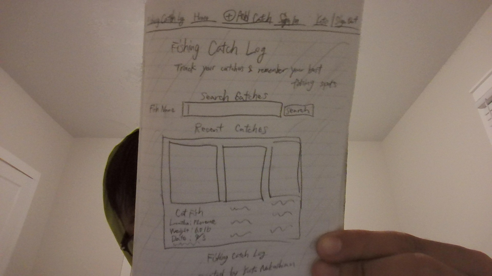

# fishing-catch-log

# Fishing Catch Log

## Description

Fishing Catch Log is a web application for anglers to record and view their fishing catches.

Users can view caught fish, fishing locations, weight, and date. Users can also use the Add Catch page to enter a new catch.

## Features

- View recent catches
- Search catches
- Add a new catch
- Sign in interface

## Wireframe

## Live Application

GitHub Pages link will be added here.
